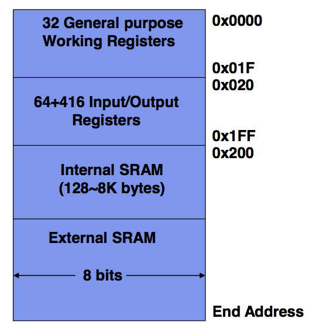
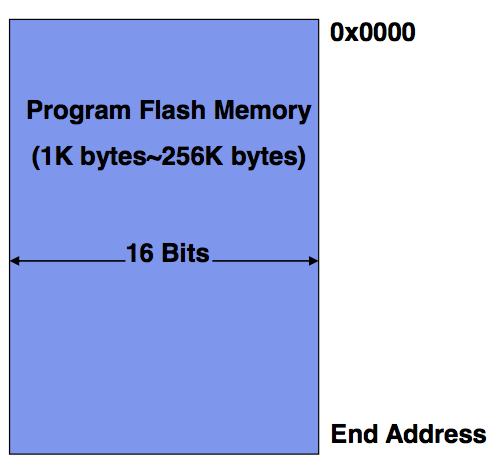
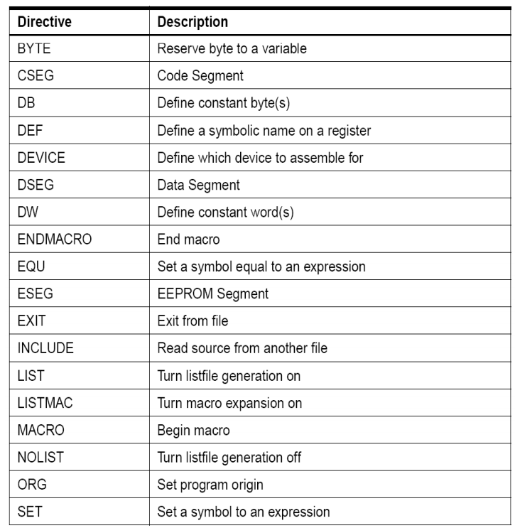
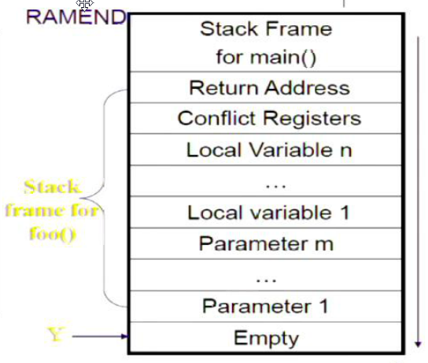
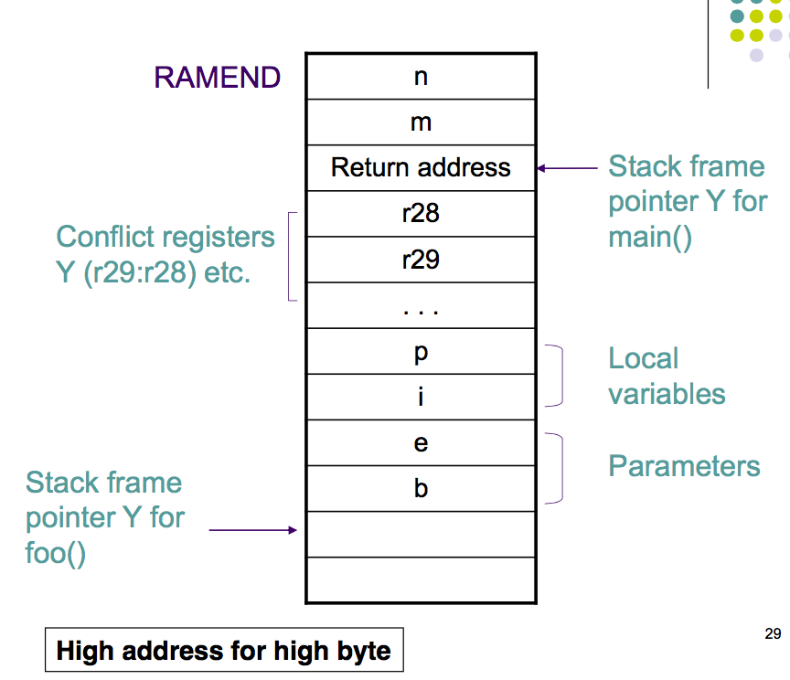

# AVR ISA / Programming

## The Chip
The AVR Industry Standard Architecture (AVR ISA) is governed by the AVR Instruction set and includes:

1. Load-Store memory access architecture
	+ This means all calculations are done on registers, not memory directly. 
	+ Memory is used to **load** to registers or **store** the registers contents. 
2. Two-Stage instruction pipelining
	+ This just means that the processor is designed to split up each instruction into multiple steps
	allowing for the processor to run multiple instructions in parallel. This increases speed as the processor
	can start another instruction before finishing the first as some parts of the new instruction use pieces of the 
	processor not currently active in the previous instructions computation. 
3. Internal Memory
4. lots of on-chip peripherals (hardware add-ons)

## General Registers
The AVR chipset has 32 8-bit registers that are extremely quick to access and work with.
We split these up into two groups, the 0-15 registers (`r0-r15`) and 16-31 (`r16-r31`)
This is because some instructions will only be able to function when working with
registers of the second higher number groups. This is because most instructions only have 16 bits to work with so for a command like `ldi` you have
```
1110 kkkk aaaa aaaa
```
`1110` indicates the command, `kkkk` is the return register and `aaaa aaaa` is the address to 
read from. As there are only 4 bits to store the return register, it can only return  to a maximum of 16 different registers. Hence why it only works on the second group of registers.


The following register pairs are commonly used as address indexs
* X - r27:r26
* Y - r29:r28
* Z - r31:r30

Note: Data that is loaded is often loaded into `r0`.

## I/O Registers

64 + 416 8 bit registers are used in input and output instructions. Mainly for storing data/instructions and control signal bits (to interact with hardware).

Some instructions will only work with I/O registers and not general purpose registers. For example `in Rd, port` will only work with an I/O register 0-63 and `lds Rd, port` will only work for io registers 64-415.
(covered in more detail in the I/O register section)

The **Status Register** in AVR is a special I/O register contains information about the most recent arithmetic instruction. 
flags allow us to extract different information about it. SREG is updated after any ALU operations by hardware. it is a 8 bit section of memory and contains 8 signal bits (in the order 7-6-5-4-3-2-1-0)

| Bit | Flag | What it does                                                  |
| --- | ---- | ------------------------------------------------------------- |
|  7  |  I   | global interrupt enable, used to enable and disable interrupts |
|  6  |  T   | Bit Copy Storage, the bit copy instruction bld (Bit load) and bst (bit store) use the T-bit as a source or destination for the operated bit. If a bit needs to be put somewhere or read in, it is done so from here.|
| 5   |  H   | half carry flag indicates a half carry (carry from bit 4) has occurred in some math|
| 4   |  S   | Exclusive OR between the Negative flag (N) and the Two's complement overflow Flag (V). tells you the sign of the resultant number taking into account if overflow has occurred. i.e what the sign SHOULD BE |
| 3   |  V   | two's complement overflow flag triggers when overflow happens during two's complement arithmetic.|
| 2   |  N   | the negative flag is the most significant bit of the result, i.e is this number negative or not.|
| 1   |  Z   | Z indicates a zero result in some logic or arithmetic operation.|
| 0   |  C   | Carry Flag, its meaning depends on the operation, for example for addition it is the carry from the most significant bit, for subtraction it indicates if the result is negative ( for x-y C is 1 when y > x)|

## AVR Address Spaces

There are 3 address spaces:

**Data Memory Space**

This includes the registers and also System Ram (SRAM).
Note the highest point in this memory is called RAMEND. 



**Program Memory Space**

This includes 16 bit flash memory which is read only. Here the 
instructions are stored. it's non-volatile, which means at sudden power
cuts the data in this is retained. 

If you know what you are doing you _CAN_ access these through lpm and spm. 



**EEPROM Memory Space**

8-bit EEPROM memory is sued to store large data sets permanently. 
not covered in this course. (but can be loaded and set to)

##AVR Instruction Format
most instructions are 1 word long, although a select few are 2 words long 
such as lds (load from data space) which reads 1 byte from SRAM and thus needs to be able to 
take in larger addresses (0 - 65535)

example of a 16 bit command is add `0001 01rd dddd rrrr`
the last 6 bits (read from right to left) are the op code, the r is the register to read in from 
and the d is the destination. they each take up their own nibble (4 bits) but because we need 32 possible values
we chuck in the last 2 bits on the remaining 2 bits. hence the weird 01rd. the reason this happens is because they want to keep the destination near the middle so it matches somewhat the ldi encoding hence the r has to split. 

example of a 32 bit command is jmp `1001 010k kkkk 110k kkkk kkkk kkkk kkkk` jump will look at the k ADDRESS and jump to that place. often we use labels to refer to some address and use that here (discussed more in addressing) so we don't have to memoruse long ass addresses. note k can be 0 to 4 megabytes which is the theoretical maximum address but realistically we use values much more close to the lower end. 

PC is program counter. jmp sets it to k. PC <-- k. this is slow and takes 3 clock cycles. 

so there are also commands like `breq k` which is branch if equal. takes a address to jump to, but can only jump 64 up or 64 down from the current PC. as this takes up 7 bits we can fit the whole isntruction into 1 word. it will check the last comparison done and if it was true, it will branch else do nothing and progress the commands. 
Remember the Z flag, it is set if the result of the last command was 0. Because comparisons just subtract two numbers, if a comparison or really subtraction results in 0, Z will be set to 1, and the two elements are equal. 
if Z=1 PC <-- PC+k+1 else PC <-- PC+1
note it takes 1 clock cycle if it's false but 2 if it needs to branch(jump). 
`11100kkkkkkk001`
the weird order is basically random.

AVR has a couple of classes of instructions, things like arithmetic and logic, logic being things such as AND, it also has data transfer instructions, program control instructions (jump, skips, subroutine etc.) and good old bit operations. 
there are also other instructions like sleep or nop. Nop is no operation, just a empty cycle of the processor. 
##AVR Addressing modes 

there are 3 main ways AVR refers to addresses. 

**Immediate Addressing**

this is when the operands come FROM the instruction call itself.
You immediately give the instruction what it needs. 

if you wanted to clear the last 4 bits of r16 you would say
`andi r16, 0x0F` also note that a 4 bit block can be call a nibble.
here we are clearing the upper nibble. (it's an AND operation)

**Register Direct Addressing**

when the operands come from general purpose registers or I/O registers. 

`add r16, r0` or `in r25, PINA`

note the in command takes the signal from pin A and puts it in r25. 

**Data Memory Addressing**

there are multiple types of data memory addressing shown below

1. data direct addressing, the address of the memory needed is given
	* `lds r5, 0xF123`
2. indirect addressing, the address is referred to by a address pointer, such as the previously mentioned X Y or Z
	* `ld r11, X`
3. indirect addressing with displacement, just taking a address pointer and shifting it over
	* `std Y+10, r14`
4. indirect addressing with pre-decrement, The data memory address is from an address pointer (X, Y, Z) and the value of the pointer is auto-decreased before each memory access. basically reduce/increase y by 1 permanently, then access the new y address. 
	* `std -Y, r14`
5. indirect addressing with post-decrement, same as above but the value is increased _AFTER_ the memory is used

**Program Memory Addressing**

Similarly, there are multiple types of program memory addressing

1. Direct Program Addressing- the instruction has the address within it
	* `jmp` PC <-- k
2. Relative Program Addressing - the instruction has a k encoded that is added to the current PC.
	* `rjmp k` PC <-- PC + k + 1
	* note rjump is quicker and smaller hence we use it
	* jmp is mostly used for jumping far away (larger programs)
3. Indirect Memory Addressing - the instruction address is implicity stored in Z register (X Y Z)
	* `icall` this takes whatever is in the Z register and jumps there. 
	* allows for runtime decisions of where to jump (rarely used)
4. Program Memory Constant Addressing, the address of the constant is stored in Z register. a constant is something which we won't change, like the name of the program. 
	* `lpm r16, Z` r16 <-- Z
5. Program Memory Addressing with post-increment - increments z after it reads in 
	* `lpm r16, Z+`

## Control Structures 

### Conditional 

| Command | Function | Words | Cycles | Example/Notes |
|---|---|---|---|---|
|cp Rd, Rr| Rd-Rr  | 1 | 1 | (compare) cp r4, r5 will set the Z flag then breq noteq (branch to noteq label) ... noteq: nop //do nothing at branch|
|cpi Rd, k | Rd - k |1 | 1|  (compare with immediate) |
|brge k | If Rd >= Rr (N XOR V=0) jump up or down by k (k can be +64 or -64) |1 | 1 if false, 2 if true | conditional branch |
|rjmp k| PC <-- PC+1+k, k can be -+ 2M | 1| 2 | relative jump |

`.def` allows you to define labels, the below codes are the same

```
if (a < 0)
	b = 1;
else
	b = -1;
```

```
.def a = r16
cpi a, 0            // a-0, result is a, compare with immediate
brge ELSE           // branch if greater then
ldi b, 1            // b = 1
rjmp END            // end of IF STATEMENT
ELSE: ldi b, -1     // b = -1
END: ...            // other code

```
note we also have brsh and brlo which are the same as brge and brlt but unsigned. 
cpi does it both ways and it's flags will help you figure out how you want to interpert it
also note here that the rjmp will take the label and calcualte the offset FOR YOU and hence tell u if it is out of the range

### Loops

lets add i^2 n times
```
.def i = r16            
.def n = r17
.def sum = r18

ldi i, 1          // initialize
clr sum           // clear sum
loop:
	cp n, i       // compare n and i
	brlo end      // branch if less than (unsigned)
	mul i, i      // square
	add sum, r0   // add to the sum (assuming 8 bit result)
	inc i         // increment i by 1
	rjmp loop     // restart loop
end:
	rjmp end      // loop over and over again as there is no halt
```


## Commands
note: In AVR a *word* is a 16 bit value

| Command      | Function | Words | Cycles | Comments       |
|--------------|----------|-------|--------|----------------|
| `sub Rd, Rr` | Rd - Rr  | 1     |      1 | Subtraction without carry |
| `mul Rd, Rr` | Rd*Rr    | 1     |      2 | Multiply two 8 bit values, the resulting 16 bit value is stored in `r1:r0`. If bit 15 is `1`, the carry flag will be set, but does not indicate an overflow.| 
| `ldi Rd, k` | Rd <- k | 1 | 1| Load register `d` with value in address `k` |
| `mov Rd, Rr` | Rd <- Rr | 1| 1| Copy value in register `r` into `d` |
| `add Rd, Rr` | Rd + Rr | 1| 1| Addition without carry |
##Example

To calculate `z = 2x - xy - x^2`, first we load our values, then we calculate the expression step by step (remember the order of operations).

Note: Because we are using `mul` at some point, we will get a 16 bit value, however, for the purpose of this example, we are assuming the answer will be 8 bits at the greatest. 

Assuming `x`, `y` and `z` are stored in `r2`, `r3` and `r4` (`r0` and `r1` are used by `mul`)

```
ldi r16, 2      		r16 <- 2;		// r16 because we are guaranteed all instructions will work
mul r16, r2     		x*2;
mov r5, r0      		r5 <- x*2;
mul r2, r3      		y * x;
sub r5, r0      		r5 <- 2x - y*x;
mul r2, r2      		x*x;
sub r5, r0      		r5 <- 2x-y*x - x^2;
mov r4, r5      		finish;
```

Note: using `mul` uses 2 cycles, so it is preferable that we minimise the amount of times we multiply two numbers. From the expression above, we can see that we can factor the `x` out.

## Assembly Program Structure

Comments can only be single lined, and must start with ';'.

### Assembler Directives


Below is a list of some assembler directives (instructions for the assembler, rather than actual instructions meant for the program). It is also useful to note that all AVR instructions and directives are case **insensitive**.



`.equ` is similar to #define, creates a constant, unredefinable. 
`.set` is a variable, it can be redefined
`.def` Define an alias for a register
`.dw ` Define word. 
`[name]:` a short-hand label for an address

Memory segment directives specify which memory segment to use and once set all commands afterwards will use the specified segment unless a new memory directive is specified. 
	* `.dseg`
		* Data segment
	* `.cseg`
		* Code segment (note: everything in cseg is 16 bits long)
	* `.eseg`
		* EEPROM segment

the `.org` directive specifies the start address
to store the related program/data. Small example

```
.dseg ; Start data segment                ; Default segment is .cseg
vartab: .byte 4 ; Reserve 4 bytes in SRAM ; (Will be at 0x200 on the atmega2560)
.cseg ; Start code segment                ; default start location is 0x0000
const: .dw 10, 0x10, 0b10, -1             ; Write 10, 16, 2, -1 in 
										  ; program memory, each value takes 2 bytes.
mov r1,r0                                 ; Do something

```

### Converting from c to assembler

ORIGINAL C
```
int a;
unsigned int b;
char c;
char* d;
```

CONVERTED
```
.dseg    	;data segment
a: .byte 2 
b: .byte 2
c: .byte 1
d: .byte 2  ;a pointrt is 16 bits. 
```

ORIGINAL C
```
int a;
const char b[] = "COMP2121";
const int c = 2121;
```

CONVERTED
```
.dseg
a: .byte 4

.cseg
b: .db "COMP2121", '/0'  ; multiple words
c: .dw 2121              ; just 1 plz

```

ORIGINAL
```
struct STUDENT_RECORD
{
 int student_ID;
 char name[20];
 char WAM;
};

typedef struct STUDENT_RECORD *student;

student s1 = {12345, "john smith", 75};
student s2;
```

CONVERTED
```
.equ student_ID = 0
.equ name = student_ID + 2
.equ WAM = name + 20
.equ STUDENT_RECORD_SIZE = WAM + 1

.cseg
s1_value: .dw 12345
		  .db ‚John Smith‛,0,0,0,0,0,0,0,0,0,0
		  .db 75

.dseg
s1: .byte STUDENT_RECORD_SIZE
s2: .byte STUDENT_RECORD_SIZE
```
note the .byte prob just stored these withing SRAM (registers) cause there arn't many and they will prob be used and discarded quick 
note static global variabels are always present during the lifetime of the program. 
note there is no system for handleing a stack overflow or heap stack collision. make sure you don't make that happen
note with structs all we do is store all the bytes in a line and keep track of where one section (like a int) ends and the next starts. 
note The constant values for initialization are stored in the program memory in order to keep the values when power is off.

Low(expression) will evlauate the expressiona nd takes the low byte. high will do the opposite. 
note bitshfiting works identically to c

note cpc is compare with carry which will compare two numbers taking into account the previous comparision. 
note that any memory in the program memory is there and constant, you can't really write to data memory and expect it to be there, it will get wiped. you also can't write to it before you start running the program, i.e you can't initialise it. 

note `ldm` is load form memory and will load from program memory but you have to give it the address in Z. it requires this tbh. 

### Macros

Allows you to set up some assembly code that you can reuse by a label. 
this is always inline, the code is copy pasted where you use the macro
you use these via the tags `.marco` and `.endmacro`. you can also give it a name and pass paramters which are references within the code via @1 @2 etc. you can then pass these in with `myMacro 1, 4, 6`

here is a swap macro that swaps memory addresses. 

```
.macro swap2
	lds r2, @0 ; load data from provided
	lds r3, @1 ; two locations
	sts @1, r2 ; interchange the data and
	sts @0, r3 ; store data back
.endmacro
swap2 a, b ; a is @0, b is @1
swap2 c, d ; c is @0, d is @1
```
### Using program memory
lets convert the following C code into some assembly
```
struct STUDENT_RECORD
{
int student_ID; char name[20]; char WAM;
};
typedef struct STUDENT_RECORD *student;
student s1 = {12345, "John Smith", 75};
```
ok so because byte addresses are double word addresses, we have to multiply a word address by 2. try to map out memory, 0 1 2 .. starting at every 16 bit word and then another set of addresses that go for every 8 bit byte, you'll to to convert between them you multiply by new
once you got the start of the word in bytes, just add one to get the one after. 
ZH is the higher byte and ZL is the lower byte

first the dseg stuff to create the data
```
.dseg
s1: .byte STUDENT_RECORD_SIZE
```
then we do some basic and code segment

```
.set student_ID = 0
.set name = student_ID + 2
.set WAM = name + 20
.set STUDENT_RECORD_SIZE = WAM + 1

.cseg rjmp start                  ; jump over data definitions

s1_value: 
	.dw HWRD(12345)
	.db "John Smith‚,0,0,0,0,0,0,0,0,0,0
	.db 75

start: 
	ldi ZH, high(s1_value<<1)     ; pointer to student initial memory
	ldi ZL, low(s1_value<<1)
	ldi YH, high(s1)              ; pointer to actual memory
	ldi YL, low(s1)
	clr r16                       ; clear register 16
load:
    cpi r16, STUDENT_RECORD_SIZE
    brge end 
	lpm r10, z+ 
	st y+, r10
	inc r16
	rjmp load
end:
	rjmp end

```
note that program memory is word addressed and ram addresses / data addresses is byte. 
note HWRD is high word, gets the high bytes. 

### Assembly
the code we write has to be converted to machine code and this is done by the assembler. there are two passes here

1. in pass one syntax and lexical errors and checked, all symboled are noted to exist, macros calls are expanded
2. use the symbol table to make sure everything is defined and fill in whatever is left, generate the actual machine code. 

there are two types of assembly
* Absolute Assembly
	* Can only be used for the source file that contains all the source code of the program
	* Programmers must use .org to tell the assembler the starting address of a segment
	* Whenever any change is made in the source program, all code must be assembled.
	* a loader loads a exectuable machine code file onto the target system
* Relocatable Assembly
	* Each source file can be assembled separately
	* Each file is assembled into an object file where some addresses may not be resolved
	* A linker program is needed to resolve all unresolved addresses and make all object files into a single executable file

### Numbering
#### Overview
* Sometimes it is easier to convert a big number to octal and then to binary, then straight to binary. 
* Binary multiplication is like normal multiplication, remember to add in the zeros per line. 
* In n-digit binary arithmetic, 2’s complement of b is b* = 2n – b
* This allows us to avoid subtraction. a - b = a + (-b) = a + b*
* with 2's compliment we have a sign bit and because of overflow it works quite nicely. 
* `0001 + 1001` = `1 + -1` = `0000` = `0`
* to convert a number into it's compliment we take the binary, swap the bits, and add 1
#### Overflow
* a quick way to see if overflow occured is to see if the carry into the high bit in the addition of two numbers is = to the carry out. if they arn't overflow happened. see below
```
1<0<0<0<
  1 0 0 0
  1 1 1 1
  --------
  0 1 1 1
```
* at the top right we have the carry out and next to that we have that carry in. we didn't carry in a 1 to trigger the binary calculation to export a 1, and yet it did it. only reason is if the final bit was a 1 1 calculation meaning we have 2 negative numbers adding together to give us a postive number. OVERFLOW
#### Floating Point (IEEE 754 FP standard)
* we represent floating point numbers with 3 peice of info
	* the sign
	* the significant
	* the exponent
* a 32 bit floating point number looks like this
	* `S EEEEEEEE 1NNNNNNNNNNNNNNNNNNNNNNN`
* S is the sign, E is the expondent and N is the number
* the first number in N is always 1, there is no reason for it to be 0 cause 01 is just 1. 
* E is some number from -127 to 126 to represent very small and very large numbers. there is no sign bit here just whatever number is read in (0-255) is subtracted from 127. the 127 is called bias. 
* `20.6` = `10100.110` = 1.0100110 × 2^4 = 0 00000100 0100110
* there are a whole bunch of special cases with this though
	* If E = 255 and F is nonzero, then V=NaN ("Not a number")
	* If E = 255 and F is zero and S is 1, then V= -Infinity
	* If E = 255 and F is zero and S is 0, then V= Infinity
	* If E = 0 and F is nonzero, then V=(-1) S * 2^-126 * 0.F. These are unnormalized numbers or subnormal numbers.
		* this comes from the fact that there are some numbers which are bigger than zero, but smaller than 1.0 × 2^min. Those numbers are the subnormals or denormals.
		* the smallest non 0 F is 1.0 and the smallest exponent is -127. 
		* so we define that if E=0 and F is nonzero we switch to 0.F to display these subnormal numbers.
		*  Subnormal numbers reduce the chance of underflow. Without subnormal numbers, the smallest positive number is 2^ –127 but With subnormal numbers, the smallest positive number is 0.00000000000000000000001 *2^-126 =2^-149
	* If E = 0 and F is 0 and S is 1, then V=-0
	* If E = 0 and F is 0 and S is 0, then V=0
#### other encoding
* you can have binary mean different things in many contextx
* some systems count up decimal by the gray system, which is where adding 1 to the number only produces 1 bit change. so 0001 doesn't mean 1 anymore, there is a new mapping. this is great when you have two chips exchanging information and if one incremeints from 1 to 2 which changes 2 bits and the other goes from 0 to 1 which is 1 bit that they don't out of sync. 
* ASCII stands for american standard code for information interchange 
* for ASCII null is 0
* to encode strings you can either have the first byte encode the length, OR have the last charecter is null OR send the string with a accompanying variable etc. 

# Stacks
## Introduction

[[ PROTIP: most of this is very confusing, read through but keep in mind the example helps the most ]]

What is stack?
* A data structure in which the data item that is Last In is First Out (LIFO)
* In AVR, a stack is implemented as a block of consecutive bytes in the SRAM memory
* A stack has at least two members:
	* Bottom
	* Stack pointer
* The stack usually grows from higher addresses to lower addresses
* in AVR, `0x0200` is the lowest address for the stack, stack bottom >=`0x0200`
* there is a built in stack pointer (SP) in `m2560def.inc` that is defaulted to `0x00000`
* its an I/O register pair, SPH:SPL (as in not a register you have but on in the I/O section)
* it can point to different things but in avr it points to the next free element that you can write to on the stack

## Pushing and popping
* to push onto the stack we use `push Rr` which puts the contents of Rr into SP and decrements SP (as the stack grows towards the lower addresses)
* pop does the opposite, `pop Rd`, puts the top element in Rd and increments SP by one
* stacks are very useful for function and sub routine calls.

## Functions
* The function being called is defined as the `callee` and the instruction calling it is the `caller`
* functions need to have flow control for the program, that is a return address so the program can continue to flow, as well as some way of passing paramters. When you jump to a function, and the function is put on the stack the address of the next command in the control flow is also put in.
* you can pass paramters by value, copy the value in, or by reference, pass in a address. it's obvious when to use one and when to use the other when it comes to small integers and larger arrays and structs
* be careful that 3 pushes are made to the stack to push on the return address, if you have a random pop you lost some of that address. any push / pop must be reverse by the time you try to jump back, the top 3 must be the return address. 
* to pass the values and have returns we have a conversion that we pass them in via specific registers and take them back. 
* you can also push on data into the stack and pop them off to pass stuff in if you are careful about not removing the address
* there is a pattern for function calls
	* Caller: make sure the callee has the paramters by storing them on the stack
		* move SP and SFP up a bit so we have space to put in paramaters and stuff. 
	* Call: use rcall or call to call the function, they work like rjump and jump, similar with slight differences in range and performance
		* icall also works and is indirect call, this will call a function from a address dynamically, a function you haven't defined, like function pointers in c
		* rcall sets the return address for you and jumps to the code. (manual is useful)
		* this can use registers and stuff as needed as the caller handle all conflicts
		* also make sure you push on the conflict registers including the stack frame register, Y
	* go back: 
		* return the value in the needed registes.
		* move the stack pointer back to deallocate the frame
		* pop off stuff and restore conflict registers (rememebr to do this in return)
		* return back to the caller using the `ret` function!

### Register conflicts and stack frames
* using registers in both a callee and caller function causes a register clash
* usually a function will take the old value in the register and put it back in once it's done using it. 
* WINAVR is a C compiler to AVR. it makes the callee save conflict registers. it can be the caller responsbility as well. 
* WINAVR uses R8~28 to store actual values and these are then shifted to the stack to free up those registers for general use 
* the return registers are set aside (in WINAVR it's 24-25)
* you can also write to a specific peice of data memory but you don't want to do that because if you call a function recursivly it will edit the same data. 
* the stack frame is a set of EXTRA data on the stack associated with some function. What we can do is manually increment the stack pointer up a bit to allocate more memory to our stack for the current function.
* the stack frame pointer is not the stack pointer. the stack pointer points to the next available peice of memory where as the stack frame pointer is beneath that so we can get at the stack frame contents. In this we may store things as a convient temp memory section
	* return address
	* conflict registers
	* paramters and local variables
* note the stack frame pointer is stored in some registers, so is usually a conflict register (Y in winavr)
* note the stack frame pointer isbelow the stack frame so any function you call has access to the callee stack frame and hence paramaters put in there. 
* note that when storing values into data you should use push and pop, but if you are doing it yourself you should do it in reverse sometimes, this is because calculating values in reverse order is faster sometimes. (i honestly have no fucken idea what daniel is on about here)
* Winavr reads it in reverse. winavr also uses Y for the stack frame pointer. 
* a diagram helps this become a bit more clear:

	
* here main calls a function called foo
* note that if the stack grows downwards we make sure Y points to the end, this is because stack uses a function called LDD, which can only adjust the pointer by +0-63, it can not reduce the address at all. so by having y at the bottom of the stack we make sure we never have to subtract it's value, if we want info from the highest element on the stack we add values and go higher 

### Example
Doesn't make sense? great job you're fucken human, here's an example, why we didn't open with this or use examples more is fucken beyond me.

sample C code
```
// int parameters b & e,
// returns an integer
unsigned int pow(unsigned int b, unsigned int e) {
	unsigned int i, p;      // local variables
	p = 1;
	for (i = 0; i < e; i++) // p = be
	       p = p*b;
	return p;               // return value of the function
}

int main(void) {
       unsigned int m, n;
	m = 2;
	n = 3;
	m = pow(m, n);
	return 0;
}
```
sample stack:



here we store on our paramaters in data memory (not on the stack, the stack jsut happens to be in the same place as our normal data memory). we then make the call (shown by the return address being pushed on), then we push on our conflict registers on such as Y, after that we get local variables manually pushed on and then the paramters. The paramaters are passed in via registers and the code then pushes it onto the stack before working with them. 

assembly code:
```
.include "m2560def.inc"
.def zero = r15 ; To store constant value 0, useful to have r15 be set as zero register

; Multiplication of two 2-byte unsigned numbers with a 2-byte result.
; All parameters are registers, @5:@4 should be in the form: rd+1:rd,
; where d is the even number, and they are not r1 and r0.
; operation: (@5:@4) = (@1:@0) * (@3:@2)
; i skip the actual caluclations in this example, as it is irrelevent
; still a good example of how to write a macro though

.macro mul2
	mul @0, @2
    movw  @5:@4, r1:r0
    mul   @1, @2
    add   @5, r0
    mul   @0, @3
	add @5, r0
.endmacro

main:
ldi YL, low(RAMEND-4)    ; this block just moves the stack pointer down 4 so we can use dseg
ldi YH, high(RAMEND-4)   ; to hold some normal values before it becomes the stack
out SPH, YH
out SPL, YL

ldi r24, low(2)          ; m = 2
ldi r25, high(2)
std Y+1, r24
std Y+2, r25

ldi r24, low(3)          ; n = 3
ldi r25, high(3)
std Y+3, r24
std Y+4, r25

						 ; main function start()
ldd r20, Y+3             ; load m and n into the stack
ldd r21, Y+4
ldd r22, Y+1
ldd r23, Y+2 
rcall pow                ; run function
std Y+1, r24             ; process return value (return value stored into m)
std Y+2, r25
end:					 ; end of main function
	rjmp end

pow:					 ; pow start
	push YL              ; conflict registers
	push YH
	push r16
	push r17
	push r18 
	push r19
	push zero
	in YL, SPL           ; override y with the stack pointer so we can work with it
	in YH, SPH           ; we read it in via in because it's a I/O register
	sbiw Y, 8            ; subtract immediate from word, allows us to shift the stack pointer
	
	out SPH, YH          ; update stack pointer with new value
    out SPL, YL

    std Y+1, r22         ; pass m to b (m is given via registers, b is in stack)
	std Y+2, r23
	std Y+3, r20         ; pass n to e (n is given via registers, e is in stack)
	std Y+4, r21

	; REST OF ACTUAL CALUCLATIONS (where mul2 would be used) ;

	ldd r25, Y+8 		 ; return p to the registers that are supposted to hold the return val
	ldd r24, Y+7
	adiw Y, 8            ; deallocate stack frame
	out SPH, YH
	out SPL, YL
	pop zero             ; return conflict
	pop r19
	pop r18
	pop r17
	pop r16
	pop YH
	pop YL
	ret                  ; jump back to main

```

note: AVR does not have add immediate instructions (addi, addci) ; but it can be done by subtracting a negative immediate.

# Busses and I/O
# Interrupts
# I/O Devices
# Analog Input and Output
# Number System & Encoding
# Serial Communication
